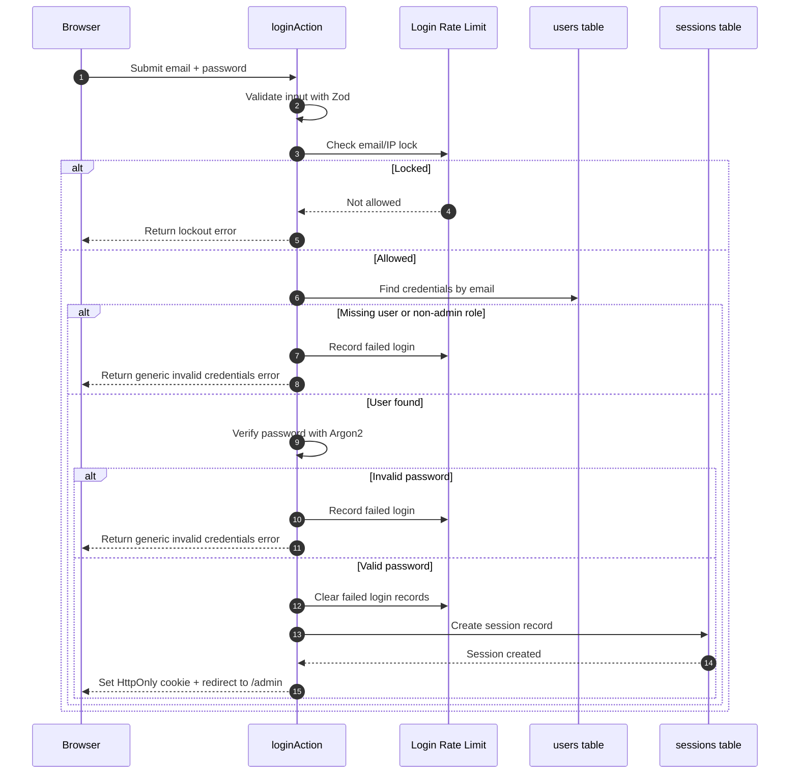
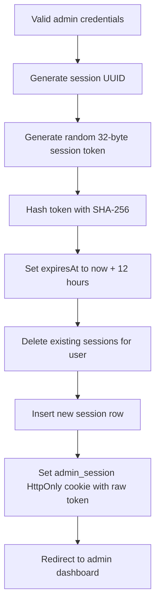
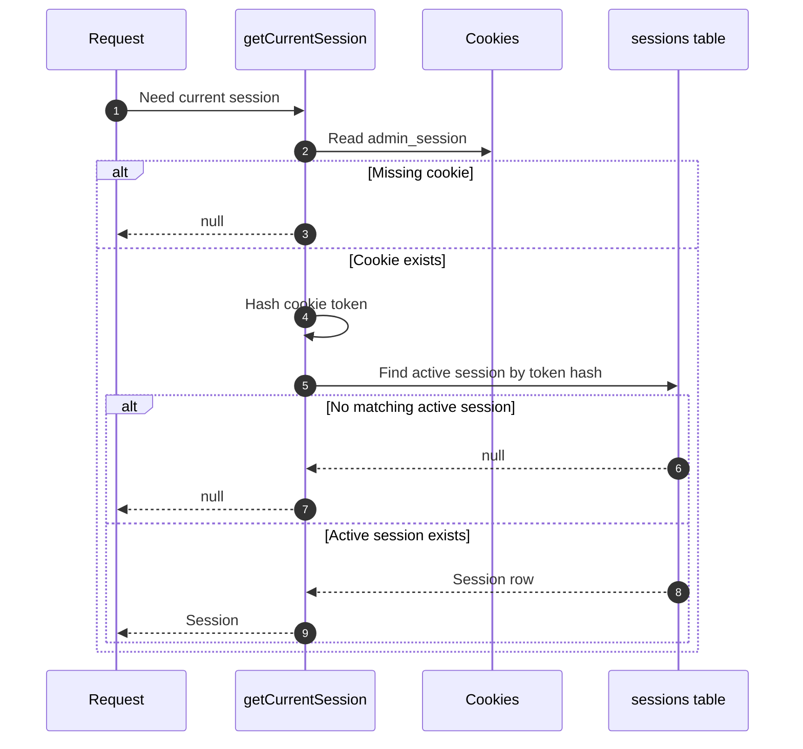
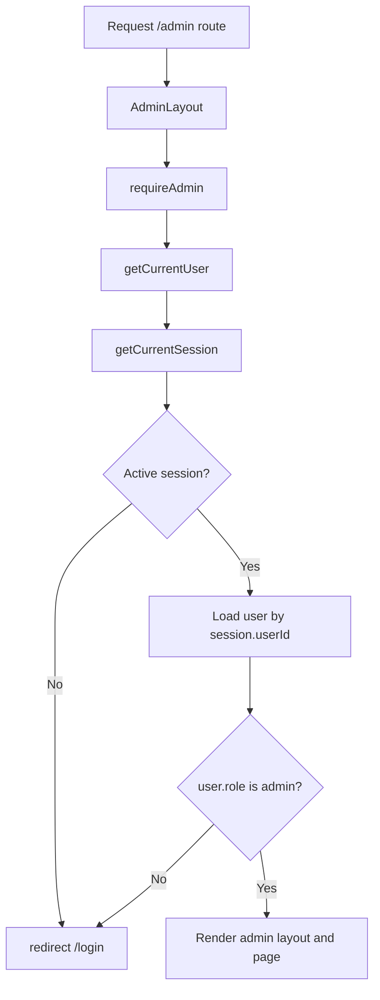
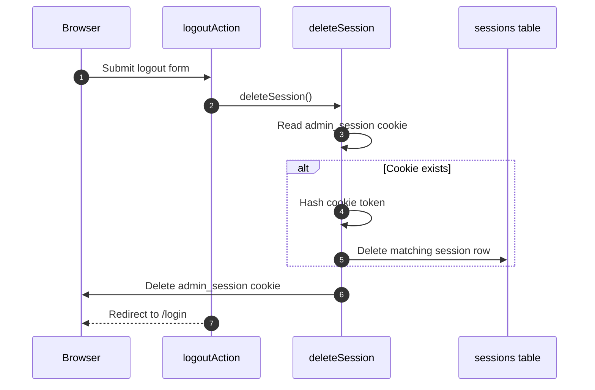

# Authentication and Authorization

This app uses custom, server-side, session-based authentication for a single-owner admin dashboard.

The important idea is:

- The browser stores only a random session token in an HttpOnly cookie.
- The database stores only a SHA-256 hash of that session token.
- The user password is stored only as an Argon2id hash.
- Admin authorization is checked on the server before rendering `/admin` routes.

This is intentionally simpler than a multi-tenant SaaS auth system. There is one supported role: `admin`.

## Main Files

| Area | File |
| --- | --- |
| Login server actions | `src/app/(auth)/login/actions.ts` |
| Login page redirect behavior | `src/app/(auth)/login/page.tsx` |
| Admin route protection | `src/app/(admin)/admin/layout.tsx` |
| Session helpers | `src/lib/auth/session.ts` |
| Current user helper | `src/lib/auth/user.ts` |
| Admin guard | `src/lib/auth/require-admin.ts` |
| Password hashing and verification | `src/lib/auth/password.ts` |
| Login rate limiting | `src/lib/auth/login-rate-limit.ts` |
| User queries | `src/db/repositories/user-repository.ts` |
| Session queries | `src/db/repositories/session-repository.ts` |
| Login attempt queries | `src/db/repositories/login-attempt-repository.ts` |
| Auth schema | `src/db/migrations/001_create_auth_tables.sql` |
| Login attempt schema | `src/db/migrations/002_create_login_attempts.sql` |
| Admin seed script | `scripts/seed-admin.ts` |

## Mental Model

Authentication answers: "Who is this request from?"

Authorization answers: "Is this authenticated user allowed to access this route?"

In this app:

1. A user signs in with email and password.
2. The server validates the credentials against the `users` table.
3. If the credentials are valid and the user has the `admin` role, the server creates a session.
4. The browser receives a random session token in the `admin_session` cookie.
5. On future admin requests, the server reads that cookie, hashes the token, finds the matching active session, loads the user, and checks that the user is an admin.
6. If the check fails, the user is redirected to `/login`.

## Data Model

### `users`

Defined in `src/db/migrations/001_create_auth_tables.sql`.

The `users` table stores admin account data:

| Column | Purpose |
| --- | --- |
| `id` | User primary key. |
| `email` | Unique login email. |
| `password_hash` | Argon2id password hash. Plain-text passwords are never stored. |
| `role` | Currently restricted to `admin`. |
| `created_at` | Creation timestamp. |
| `updated_at` | Update timestamp. |

The schema has a role check constraint:

```sql
constraint users_role_check check (role in ('admin'))
```

That means the app currently supports only admin users.

### `sessions`

Defined in `src/db/migrations/001_create_auth_tables.sql`.

The `sessions` table stores server-side session records:

| Column | Purpose |
| --- | --- |
| `id` | Session primary key. |
| `user_id` | Owner of the session. Cascades on user deletion. |
| `session_token_hash` | SHA-256 hash of the browser session token. |
| `user_agent` | Optional request user agent snapshot. |
| `ip_address` | Optional request IP snapshot. |
| `created_at` | Session creation timestamp. |
| `expires_at` | Session expiration timestamp. |

Indexes:

- `sessions_user_id_idx`
- `sessions_expires_at_idx`
- `sessions_one_active_session_per_user_idx`

The unique `sessions_one_active_session_per_user_idx` index enforces one session row per user. The repository also deletes any existing sessions for the user before inserting a new one.

### `login_attempts`

Defined in `src/db/migrations/002_create_login_attempts.sql`.

The `login_attempts` table stores failed login tracking:

| Column | Purpose |
| --- | --- |
| `identifier_hash` | SHA-256 hash of `email:ipAddress`. |
| `failed_attempt_count` | Number of failed attempts for that identifier. |
| `first_failed_at` | First failed attempt timestamp. |
| `last_failed_at` | Most recent failed attempt timestamp. |
| `locked_until` | Temporary lockout expiration timestamp. |

The app does not store the raw email/IP pair in this table. It stores only the derived identifier hash.

## Password Handling

Password logic lives in `src/lib/auth/password.ts`.

The app uses `argon2` with Argon2id:

- `memoryCost: 65536`
- `timeCost: 3`
- `parallelism: 1`

`hashPassword(password)` hashes a new password.

`verifyPassword(password, passwordHash)` verifies a submitted password against the stored hash. It returns `false` if the password/hash is missing or if verification throws.

The admin seed script, `scripts/seed-admin.ts`, reads `ADMIN_EMAIL` and `ADMIN_PASSWORD`, hashes the password, and upserts the admin user.

## Login Flow

Implemented in `src/app/(auth)/login/actions.ts`.

The login action performs these steps:

1. Read request metadata:
   - `user-agent`
   - first value from `x-forwarded-for`
2. Validate form input with Zod:
   - email is trimmed, lowercased, max 254 characters, and must be a valid email
   - password must be present and max 256 characters
3. Check whether login is currently allowed for the email/IP identifier.
4. Load admin credentials by email.
5. Reject if the user does not exist or the role is not `admin`.
6. Verify the password with Argon2.
7. Record a failed login if the email or password is invalid.
8. Clear failed login records after a successful login.
9. Create a server-side session.
10. Redirect to:
    - `/admin` for a normal login
    - `/admin?session=replaced` if a previous active session existed

Invalid credentials return a generic error message. This avoids revealing whether the email exists.



## Session Creation

Implemented in `src/lib/auth/session.ts` and `src/db/repositories/session-repository.ts`.

When `createSession(userId, metadata)` runs:

1. Generate a session ID with `randomUUID()`.
2. Generate a random 32-byte token using `randomBytes(32).toString("base64url")`.
3. Hash the token with SHA-256.
4. Set expiration to 12 hours from the current time.
5. Create the session record in the database.
6. Set the raw token in the `admin_session` cookie.

The cookie settings are:

| Option | Value |
| --- | --- |
| `httpOnly` | `true` |
| `secure` | `true` in production |
| `sameSite` | `"lax"` |
| `path` | `"/"` |
| `expires` | Same as the database session expiration |

The raw session token is never stored in the database. If the database is leaked, the attacker gets token hashes, not directly usable session tokens.



## Single Active Session Behavior

Session creation uses a serializable transaction in `createSessionRecord`.

Inside that transaction, the app:

1. Checks whether the user already has an active session.
2. Deletes all existing sessions for that user.
3. Inserts the new session.

The returned `replacedExistingSession` flag tells the login action whether a previous active session existed. If it did, the user is redirected to `/admin?session=replaced`.

This means a new login invalidates previous sessions for the same admin user.

## Session Lookup

Implemented in `getCurrentSession()`.

On a protected request:

1. Read the `admin_session` cookie.
2. If the cookie is missing, return `null`.
3. Hash the cookie token with SHA-256.
4. Query the `sessions` table for a matching `session_token_hash`.
5. Require `expires_at > now()`.
6. Return the session or `null`.

Expired sessions are not treated as authenticated sessions.



## Current User Lookup

Implemented in `src/lib/auth/user.ts`.

`getCurrentUser()` builds on `getCurrentSession()`:

1. Get the current active session.
2. If there is no session, return `null`.
3. Load the user by `session.userId`.
4. Return only safe user fields:
   - `id`
   - `email`
   - `role`

The current user query does not return `password_hash`.

## Authorization

Implemented in `src/lib/auth/require-admin.ts`.

`requireAdmin()` performs the authorization check:

1. Call `getCurrentUser()`.
2. If there is no user, redirect to `/login`.
3. If `user.role !== "admin"`, redirect to `/login`.
4. Otherwise, return the admin user.

The admin route group calls this in `src/app/(admin)/admin/layout.tsx` before rendering admin UI. Because layouts wrap nested routes, this protects the admin pages under `/admin`.



## Login Page Redirect Behavior

Implemented in `src/app/(auth)/login/page.tsx`.

When a logged-in admin visits `/login`, the page calls `getCurrentUser()`.

- If a user exists, it redirects to `/admin`.
- If no user exists, it renders the login form.

This prevents an already-authenticated admin from seeing the login screen again.

## Logout Flow

Implemented in `logoutAction()` and `deleteSession()`.

When the admin logs out:

1. Read the `admin_session` cookie.
2. If the cookie exists, hash its token.
3. Delete the matching session row from the database.
4. Delete the browser cookie.
5. Redirect to `/login`.



## Login Rate Limiting

Implemented in `src/lib/auth/login-rate-limit.ts`.

The app rate-limits failed login attempts by hashing:

```txt
email:ipAddress
```

with SHA-256.

Current settings:

| Setting | Value |
| --- | --- |
| Maximum failed attempts | 5 |
| Lock duration | 15 minutes |

Before validating credentials, the login action calls `isLoginAllowed(email, ipAddress)`.

Failed login cases call `recordFailedLogin(email, ipAddress)`.

Successful login calls `clearFailedLogins(email, ipAddress)`.

## Security Properties

The current design has these security properties:

- Passwords are hashed with Argon2id.
- Plain-text passwords are never stored.
- The session cookie is HttpOnly, so client-side JavaScript cannot read it.
- The session cookie is Secure in production.
- The cookie uses `sameSite: "lax"` to reduce CSRF exposure for normal cross-site requests.
- Only the random session token is stored in the browser.
- Only the SHA-256 session token hash is stored in the database.
- Session lookup requires the database session to be unexpired.
- Admin authorization happens on the server.
- Admin routes are protected by the `/admin` layout.
- Password hashes are not returned by `getCurrentUser()`.
- Failed login tracking avoids storing the raw email/IP identifier in the `login_attempts` table.

## Current Limitations and Follow-ups

These are not necessarily bugs, but they are useful to know before expanding the auth system:

1. The app supports only one role: `admin`.
2. A new login replaces any previous session for the same user.
3. Expired session rows are ignored but not automatically cleaned up during lookup.
4. The app depends on `x-forwarded-for` for IP metadata, which is normal behind a trusted platform proxy but should not be trusted blindly outside that setup.
5. There is no password reset flow.
6. There is no email verification flow.
7. There is no audit log for admin actions.
8. The current authorization model protects pages through the admin layout. If future route handlers mutate admin data, those handlers should also call `requireAdmin()` or an equivalent server-side guard.

## Practical Checklist for Future Admin Features

When adding a new admin page:

1. Put it under `/admin` so it is wrapped by `src/app/(admin)/admin/layout.tsx`.
2. Keep admin data loading on the server when possible.
3. Do not pass password hashes, session token hashes, or secrets to Client Components.
4. If adding a route handler or server action that changes data, check admin authorization inside that server entry point.
5. Prefer `getCurrentUser()` when the page only needs user identity.
6. Prefer `requireAdmin()` when access must be denied without an admin user.

